Reference Website:
[https://qsvending.com.au/blog/5-reasons-why-vending-machines-are-perfect-for-Melbourne-workplaces](https://qsvending.com.au/blog/5-reasons-why-vending-machines-are-perfect-for-queensland-workplaces)

Blogs |  Services  |  Enqurie  |  Locations

GET YOUR FREE VENDING MACHINE

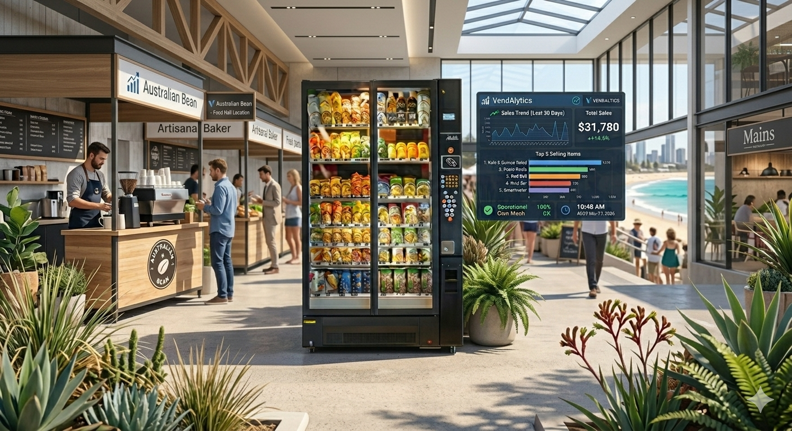

**FAST AND DEPENDABLE**  
100% Free Vending Machine Installation in Melbourne  
Enjoy fully stocked vending machines with complimentary installation,
restocking, and maintenance across Melbourne — no hidden costs, just
seamless service.  
+61 401 112 699  
CALL NOW!

ABOUT US  
**$0 Vending Machine Hire & Installation Across Melbourne**  
We offer no-cost vending machine solutions, including installation,
servicing, and restocking for your business. Ideal for offices, schools,
gyms, and public spaces, our machines provide a variety of snacks,
drinks, and healthy choices.

[ENQUIRE NOW](https://qsvending.com.au/enquire)

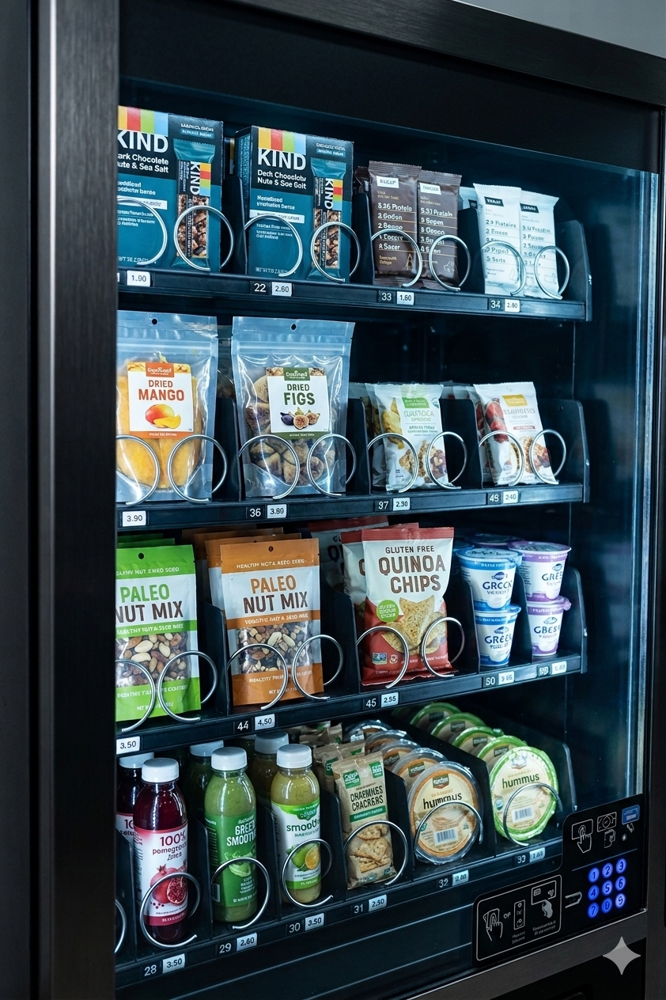

SERVICES

**What We Offer**

Complimentary installation, routine restocking, and ongoing maintenance,
customised to suit the needs of businesses and public spaces throughout
Melbourne.

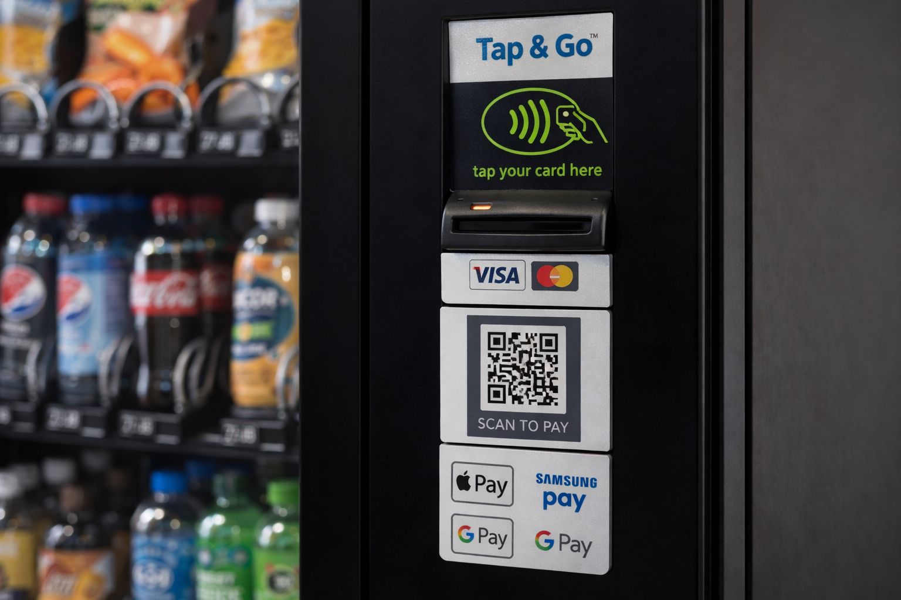

**Vending Machine Installation**

Fast, Professional, and Hassle-Free

[READ MORE](https://qsvending.com.au/services/repair-install/)

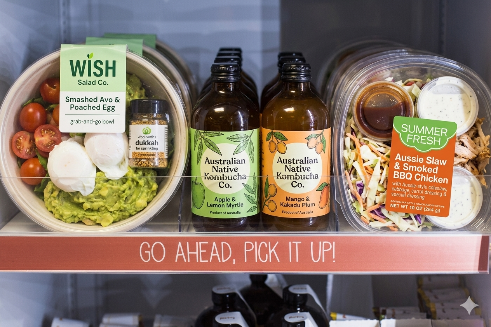

**Healthy Snack Options**

Nourishing Choices On-the-Go

[READ MORE](https://qsvending.com.au/services/commercial-plumbing/)

**<s>Promotional Vending Machines</s>**

<s>Unique Branding Opportunities</s>

[<s>READ MORE</s>](https://qsvending.com.au/services/bathroom-fitting/)

WORKING PROCESS

**Our Standard Working Process**

1.  **Consultation & Customization**

We evaluate your site and requirements to recommend the most suitable
vending machine and product mix for your business or space.

1.  **Free Installation**

Our team supplies and installs the vending machine at no charge,
positioning it for maximum convenience and efficiency.

1.  **Support & Maintenance**

We handle routine restocking and complimentary maintenance to ensure
your machine stays fully stocked and operates smoothly.

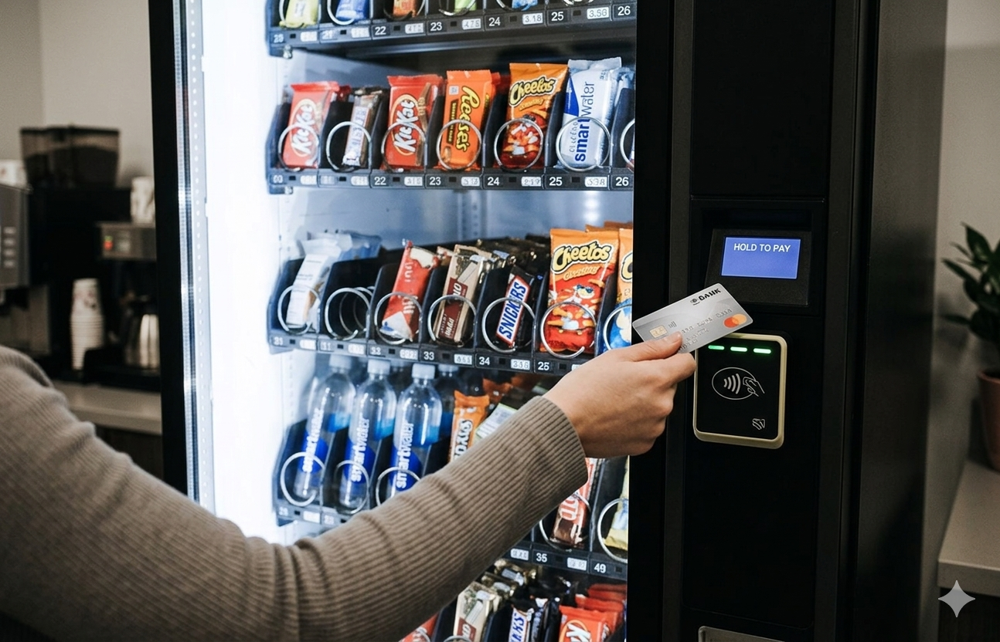

WHY CHOOSE US

**We make it easy for you**

**$0 Installation & Maintenance**

Complimentary installation, restocking, and maintenance — with no hidden
fees.

**Custom Solutions**

A diverse selection of snacks, beverages, and healthy options tailored
to your business.

[FIND OUT MORE](https://qsvending.com.au/enquire)

<s>TESTIMONIAL</s>

**<s>What our clients say</s>**

NEWS & BLOG

**Browse our latest articles**

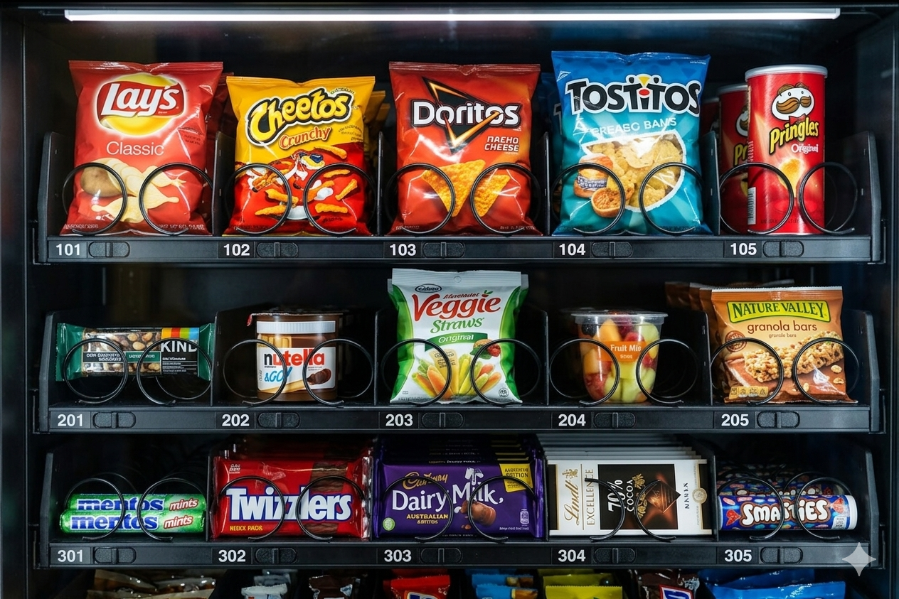

**BUSINESS**  
Top-Selling Vending Machine Products in Melbourne  
Vending machines today offer far more than basic snacks. Modern
solutions provide a wide range of popular, in-demand products tailored
to suit different tastes and preferences.

[Continue
Reading](https://qsvending.com.au/blog/top-7-vending-machine-locations-in-queensland-for-maximum-profit-copy)

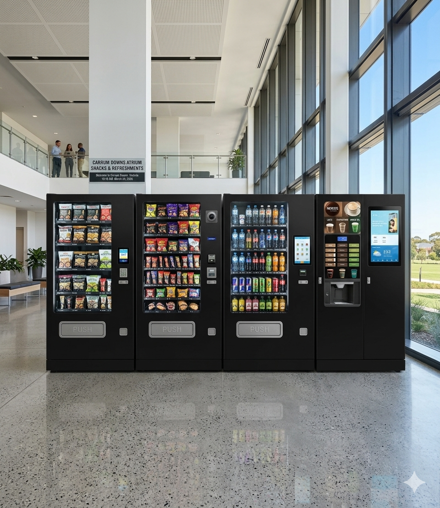

Business

**5 Reasons Why Vending Machines Are Perfect for Melbourne Workplaces**

<s>Interactively provide access to open-source e-business without
compelling e-markets.</s>

[<s>Continue
Reading</s>](https://qsvending.com.au/blog/5-reasons-why-vending-machines-are-perfect-for-queensland-workplaces)

<s>BUSINESS</s>

**<s>Top 7 Vending Machine Locations in Melbourne for Maximum
Profit</s>**

<s>Interactively provide access to open-source e-business without
compelling e-markets.</s>

[<s>Continue
Reading</s>](https://qsvending.com.au/blog/top-7-vending-machine-locations-in-queensland-for-maximum-profit)

**Looking for a reliable, hassle-free installation?**

[+61](https://qsvending.com.au/enquire) 401 112 699

[CALL NOW!](https://qsvending.com.au/enquire)

ABOUT

Enjoy 24/7 support, cashless payments, and regular restocking. Perfect
for offices, schools, and more. Contact us today!

LINKS

[About](https://qsvending.com.au/)

[Services](https://qsvending.com.au/services)

[Blog](https://qsvending.com.au/blog)

[Contact](https://qsvending.com.au/)

INFO

[+61](https://qsvending.com.au/enquire) 401 112 699

info@lancepmc.com

© 2024 | All Right Reserved | [Website by NewLead
Digital](https://newleadigital.com/)

**<u>  
</u>**

**<u>BLOGS</u>**

<u>Blog No. 1</u>

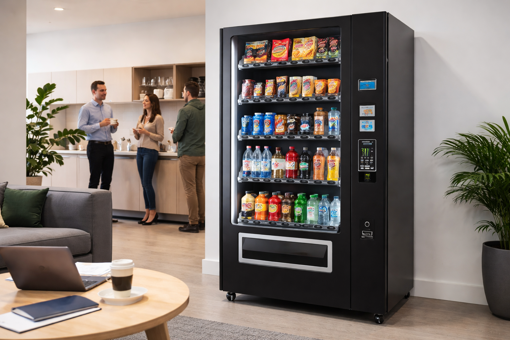

**📝 5 Reasons Every Office, Gym, Hospital and Warehouse in Melbourne
Should Have a Vending Machine**

In a fast-paced city like Melbourne, convenience and efficiency play a
major role in how workplaces operate. Whether it’s a corporate office in
the CBD, a 24/7 gym, a busy hospital, or a large warehouse, having easy
access to food and drinks is no longer a luxury—it’s an expectation.

One of the simplest and most effective ways to meet this demand is by
installing a vending machine. Modern vending solutions go far beyond
traditional snack dispensers, offering smart technology, healthier
options, and seamless payment systems.

Here are five key reasons why vending machines are becoming essential
across Melbourne workplaces.

------------------------------------------------------------------------

**1. Convenience for Staff and Visitors**

One of the biggest advantages of vending machines is the immediate
convenience they provide. Employees and visitors can quickly grab a
snack or drink without leaving the premises, saving time and effort
during busy days.

In workplaces where time is critical—such as hospitals, warehouses, and
gyms—this convenience becomes even more valuable. Staff don’t need to
travel offsite or wait in long café queues, which can disrupt workflow
and reduce efficiency.

Vending machines also operate 24/7, making them ideal for shift-based
industries. Whether it’s an early morning start or a late-night shift,
refreshments are always available when needed.

------------------------------------------------------------------------

**2. Improves Productivity and Energy Levels**

Access to food and drinks directly impacts employee performance. When
staff are hungry or dehydrated, energy levels drop and concentration
suffers.

Vending machines provide quick access to energy-boosting snacks and
drinks, helping employees stay focused throughout the day. Instead of
taking long breaks to find food, workers can grab what they need in
minutes and return to their tasks.

This is especially important in physically demanding environments like
warehouses or mentally intensive roles in offices. Even a small boost in
energy can significantly improve productivity across a team.

------------------------------------------------------------------------

**3. Cost-Effective and Hassle-Free Solution**

For business owners, vending machines are one of the most cost-effective
workplace upgrades available.

Unlike running a café or managing a staff kitchen, vending machines
require:

- No additional staff

- Minimal space

- Little to no ongoing management

Most vending providers in Melbourne handle everything—from installation
to restocking and maintenance—at no cost to the business. This makes it
a completely hands-off solution that delivers value without adding
operational complexity.

------------------------------------------------------------------------

**4. Supports Health and Wellness**

Modern vending machines are no longer limited to sugary snacks and soft
drinks. Today’s machines can be stocked with a wide range of healthier
options, including:

- Protein bars

- Low-sugar beverages

- Nuts and trail mixes

- Fresh food and meal options

This is particularly beneficial in environments like gyms and hospitals,
where health and wellbeing are a priority. Providing better food choices
encourages healthier habits and helps staff maintain consistent energy
levels throughout the day.

As Melbourne continues to embrace a more health-conscious lifestyle,
offering nutritious vending options can also enhance workplace culture
and employee satisfaction.

------------------------------------------------------------------------

**5. Boosts Employee Satisfaction and Workplace Culture**

Small perks can make a big difference in how employees feel about their
workplace. A vending machine may seem like a minor addition, but it
shows that a business values the comfort and convenience of its staff.

Having easy access to snacks, drinks, and essentials creates a more
supportive and enjoyable work environment. It can also improve morale,
especially in high-pressure or long-hour industries.

In shared spaces like offices and gyms, vending machines can even
encourage short breaks and social interaction, contributing to a more
positive workplace culture overall.

------------------------------------------------------------------------

**💡 Final Thoughts**

Vending machines are a simple yet powerful addition to any workplace in
Melbourne. They provide convenience, improve productivity, support
employee wellbeing, and require minimal effort to maintain.

Whether you manage an office, gym, hospital, or warehouse, installing a
vending machine is a practical step towards creating a more efficient
and employee-friendly environment.

As workplace expectations continue to evolve, businesses that prioritise
convenience and staff wellbeing will always stay one step ahead.

<u>Blog No. 2:</u>

**📝 Cashless Payments & Tap-and-Go: Essential for Vending Machines in
This Decade**

------------------------------------------------------------------------

**🔹 1. Why Cashless is No Longer Optional**

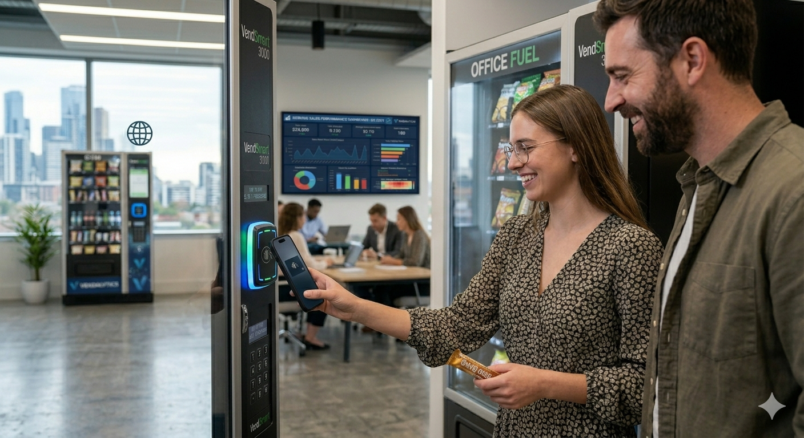

In Melbourne workplaces, gyms, hospitals, and warehouses, customers
expect **fast, hassle-free payment options**. Cashless payments and
tap-and-go technology in vending machines have become standard. People
don’t want to carry coins or wait for change—modern payment methods save
time and make every transaction seamless.

------------------------------------------------------------------------

**🔹 2. Convenience for Everyone**

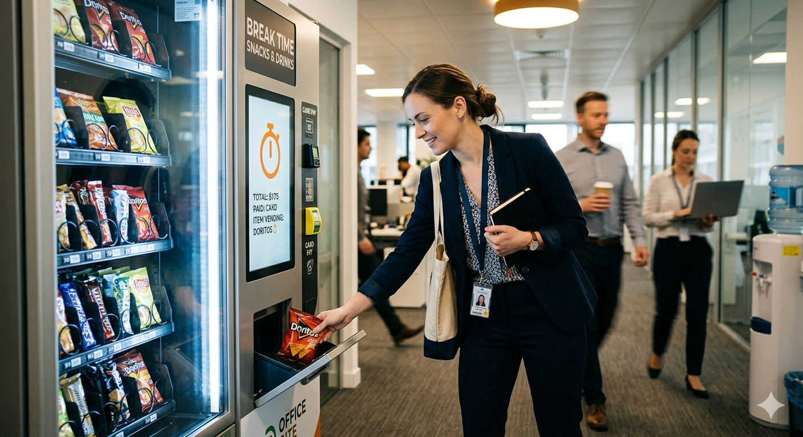

Tap-and-go payments allow users to grab snacks or drinks **instantly**.
In fast-paced environments, every second counts. By making it quick and
easy to buy what they need, vending machines improve customer
satisfaction and encourage repeat use.

------------------------------------------------------------------------

**🔹 3. Efficiency for Operators**

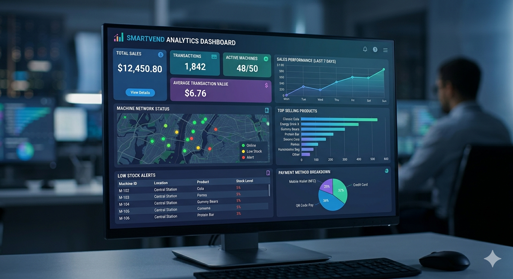

For vending machine operators, cashless technology means **less cash
handling and more accurate sales tracking**. Real-time sales data allows
for smarter restocking and reduces downtime, ensuring machines are
always ready for customers. It’s a win-win for both users and operators.

------------------------------------------------------------------------

**🔹 4. Meeting Melbourne’s Modern Expectations**

Across Australia, people are increasingly using cards, smartphones, and
smartwatches for daily purchases. Vending machines with tap-and-go meet
**the expectations of tech-savvy customers** and future-proof your
service for this decade.

------------------------------------------------------------------------

**🔹 5. The Bottom Line: Add Value to Your Property**

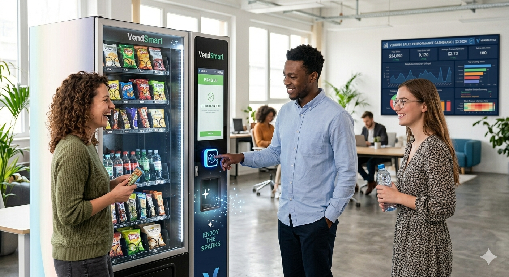Installing
a vending machine with cashless and tap-and-go functionality **adds
value to your property or business**. It provides convenience for
customers, efficiency for operators, and aligns with modern payment
habits, making it a simple yet powerful upgrade for Melbourne
workplaces.

<u>Blog No.3:</u>

**🔧 Technology & Innovation in Vending Machines: What Melbourne
Businesses Need to Know**

The vending machine industry is evolving fast, and Melbourne businesses
are reaping the benefits. From offices to gyms, hospitals to warehouses,
vending machines are no longer just snack dispensers—they’re **smart,
efficient, and customer-focused**. Here’s how technology is shaping the
vending experience this decade.

**🤖 Smart Vending Machines: Convenience Meets Innovation**

Smart vending machines track inventory, suggest popular items, and even
provide tailored options for each location. They alert operators when
restocking or maintenance is needed, reducing downtime and keeping
customers satisfied. For Melbourne workplaces, this means **reliable
service, happier users, and less hassle**.

------------------------------------------------------------------------

**💳 Cashless Payments & Tap-and-Go: Fast, Easy, Modern**

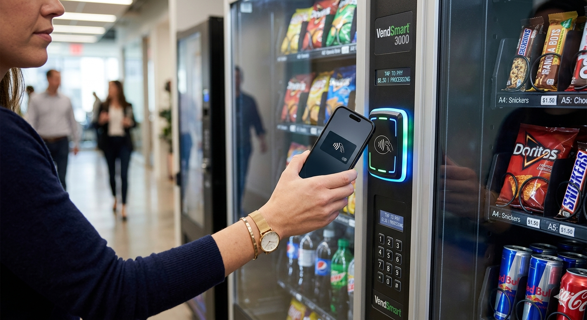

Customers expect **quick, contactless payments**. Tap-and-go vending
machines let users pay with cards, phones, or smartwatches. For
operators, this reduces cash handling and provides real-time sales
tracking. In Melbourne, cashless payments are no longer optional—they’re
a must-have.

------------------------------------------------------------------------

**📊 How Data Analytics Optimises Sales**

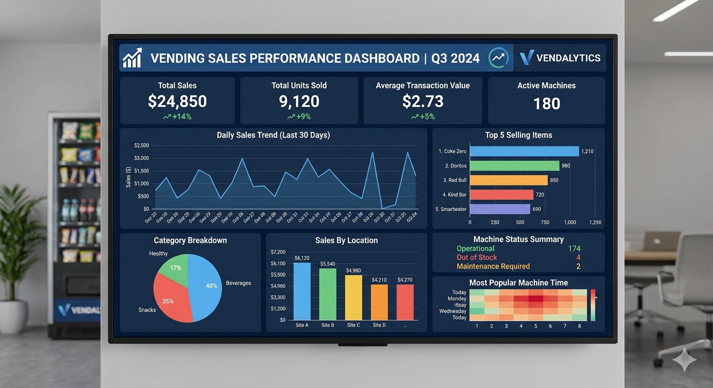

Data analytics allows operators to track which products sell, when, and
where. This helps optimise stock, reduce waste, and meet customer demand
more effectively. Analytics also highlight trends and seasonal
preferences. For Melbourne operators, **using data leads to smarter
decisions and higher revenue**.

------------------------------------------------------------------------

**🌐 Remote Monitoring Systems: Keep Machines Running Smoothly**

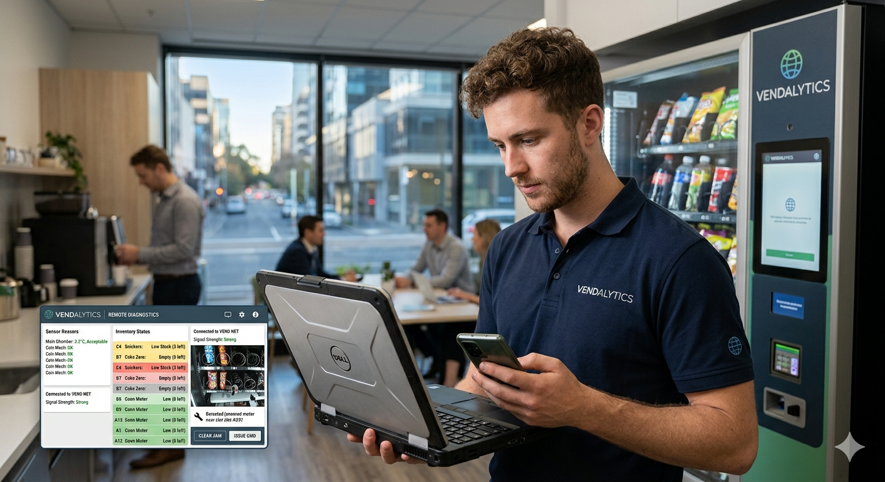

Remote monitoring systems notify operators about low stock or technical
issues in real time. This ensures machines are always operational and
reduces downtime. For busy Melbourne offices, gyms, and warehouses,
**remote monitoring improves reliability and customer satisfaction**.

------------------------------------------------------------------------

**🤯 AI in Vending Machines: The Next Frontier**

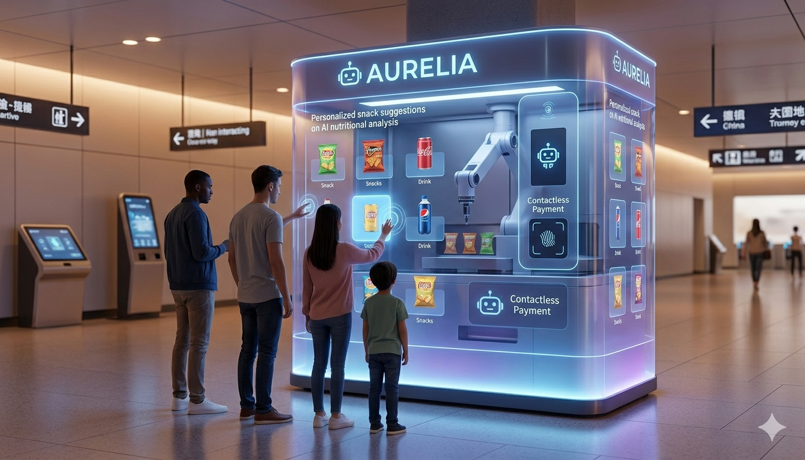

Artificial intelligence is the next big step in vending technology. AI
can predict demand, suggest products to customers, and automatically
optimise stock levels. Melbourne operators adopting AI can **increase
sales, improve customer experience, and future-proof their machines**.

------------------------------------------------------------------------

**✅ Final Thoughts**

Technology is transforming vending machines into **smart, convenient,
and customer-focused solutions**. For Melbourne businesses, investing in
smart machines, cashless payments, data analytics, remote monitoring,
and AI is a simple way to improve service, reduce operational headaches,
and delight users.

Vending machines are no longer just amenities—they are **modern
essentials** that enhance your property, workplace, or business.

------------------------------------------------------------------------

***CTA Section:***

**Text:**  
“Ready to upgrade your vending experience? Contact us today to explore
**smart vending solutions** for your Melbourne business.”

**CTA Button:** “Get Started”

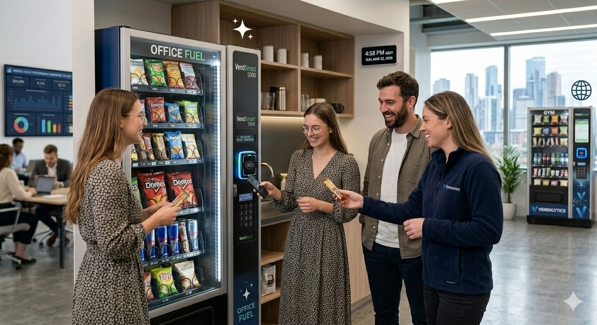

**<u>SERVICES:</u>**

1.  **VENDING MACHINE INSTALLATION  **
    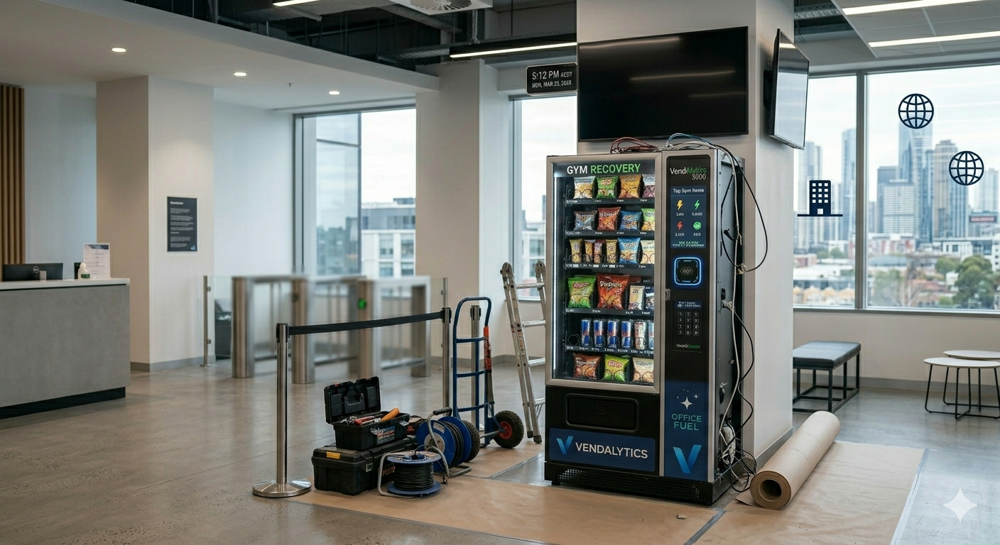

**Vending Machine Installation in Melbourne – Fast & Reliable**

Need vending machine installation in Melbourne? \[Business Name\]
provides efficient, hassle-free setup for offices, schools, gyms, and
public spaces. Whether it’s one machine or multiple units, we deliver a
solution tailored to your site.

------------------------------------------------------------------------

**Why Work With Us?**

- **Skilled Team:** Experienced technicians ensure safe, accurate
  installation.

- **Custom Fit:** Machines selected to suit your space and needs.

- **Complete Service:** From site check to setup and testing, we handle
  it all.

- **Modern Machines:** Cashless payments, energy-efficient, and
  user-friendly.

- **Ongoing Support:** Maintenance, servicing, and restocking available.

------------------------------------------------------------------------

**Our Process**

- **Site Review:** Identify the best location.

- **Recommendations:** Choose the right machine and setup.

- **Quick Installation:** Delivery, setup, and ready-to-use handover.

- **Support:** Training and ongoing service as needed.

------------------------------------------------------------------------

**Melbourne Coverage**

We service Melbourne and surrounding areas, delivering vending solutions
ideal for busy environments with convenient access to refreshments.

1.  **HEALTHY SNACK OPTIONS**

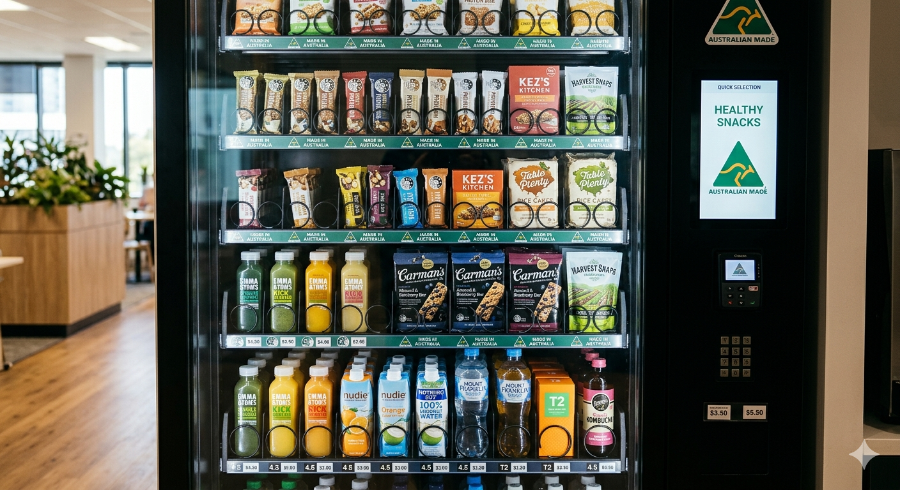

**Healthy Snack Vending Machines in Melbourne**

At Vendaroo, we provide healthy snack vending machines
across Melbourne for offices, schools, gyms, and public spaces. Our
machines offer convenient access to nutritious options, helping promote
better eating habits on the go.

------------------------------------------------------------------------

**Why Choose Our Machines?**

- **Healthier Choices:** A wide range of snacks including low-sugar,
  gluten-free, vegan, and high-protein options.

- **Custom Selection:** Products tailored to suit your location and
  audience.

- **Fresh & Stocked:** Regular restocking ensures quality and variety at
  all times.

- **Wellness Focused:** Encourage healthier lifestyles in your workplace
  or facility.

- **Cashless Payments:** Easy, contactless purchasing for convenience.

------------------------------------------------------------------------

**How It Works**

- **Consultation:** We assess your needs and recommend suitable options.

- **Installation:** Fast, professional setup at your location.

- **Ongoing Service:** Regular restocking, maintenance, and support.

------------------------------------------------------------------------

**Melbourne Coverage**

We service Melbourne and surrounding areas, delivering modern vending
solutions designed to make healthy snacking simple and accessible.
